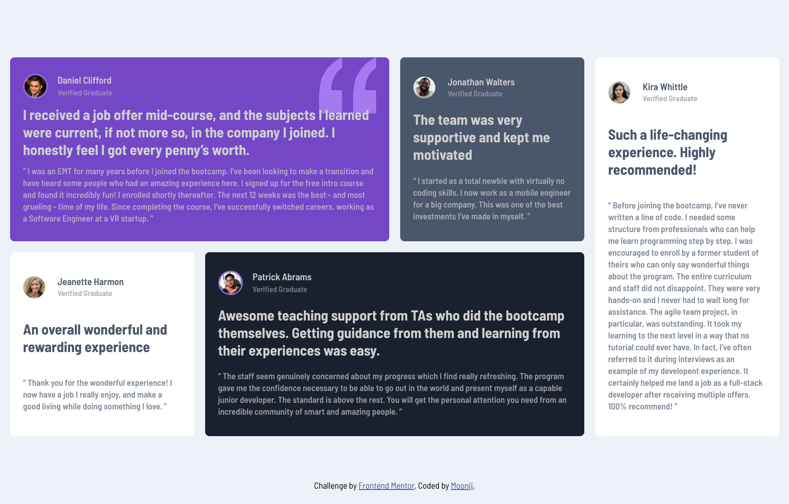

# Frontend Mentor - Testimonials grid section solution

This is a solution to the [Testimonials grid section challenge on Frontend Mentor](https://www.frontendmentor.io/challenges/testimonials-grid-section-Nnw6J7Un7). Frontend Mentor challenges help you improve your coding skills by building realistic projects. 

## Table of contents

- [Overview](#overview)
  - [The challenge](#the-challenge)
  - [Screenshot](#screenshot)
  - [Links](#links)
- [My process](#my-process)
  - [Built with](#built-with)
  - [Continued development](#continued-development)
  - [Useful resources](#useful-resources)
- [Author](#author)

## Overview

### The challenge

Users should be able to:

- View the optimal layout for the site depending on their device's screen size

### Screenshot

<ins>Frontend Mentor's Desktop Design:</ins>

<ins>My Desktop Solution: </ins>

<ins>Frontend Mentor's Mobile Design:</ins>

<ins>My Mobile Solution: </ins>

### Links

- Solution URL: [Testimonial Grid Solution](https://testimonials-grid-moonji.netlify.app/)

## My process

### Built with

- Semantic HTML5 markup
- CSS custom properties
- Flexbox
- CSS Grid
- Mobile-first workflow

### Continued development

I want to continue working on mobile-first design. I don't know if that approach worked well for this projects, so I will probably retry this in reverse.

### Useful resources

- [Medium](https://medium.com/@usman_qb/mobile-first-css-approach-83e75e87d606) - I quickly read this article to help me figure out a plan for my mobile-first design. 

## Author

- Frontend Mentor - [@moonji-spoonji](https://www.frontendmentor.io/profile/moonji-spoonji)

